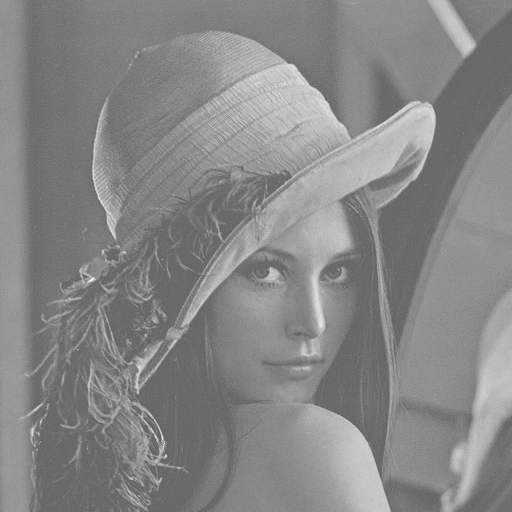
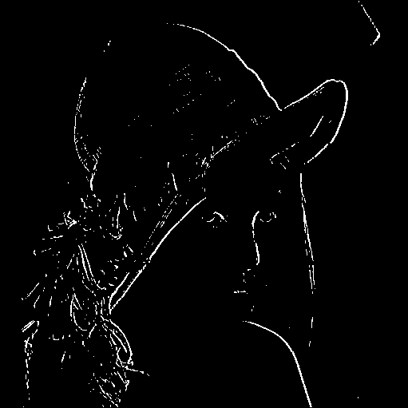
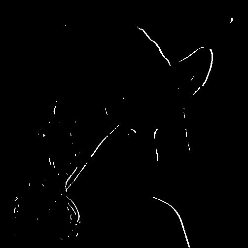
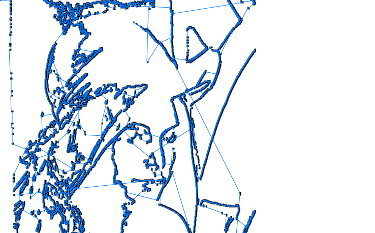
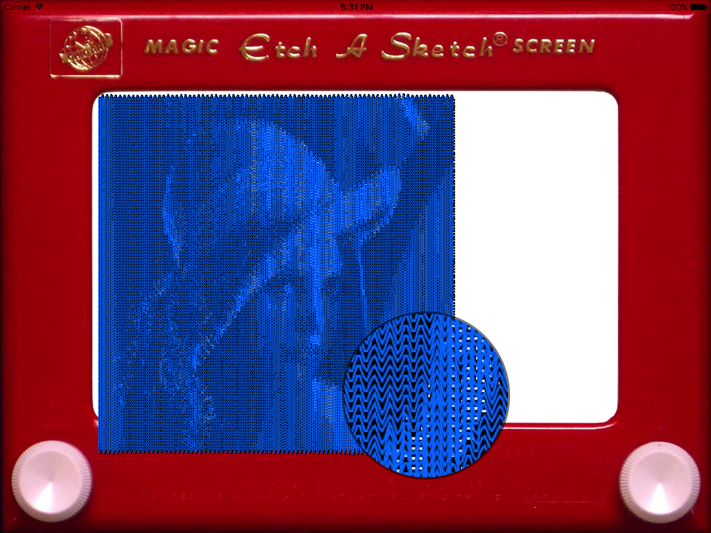
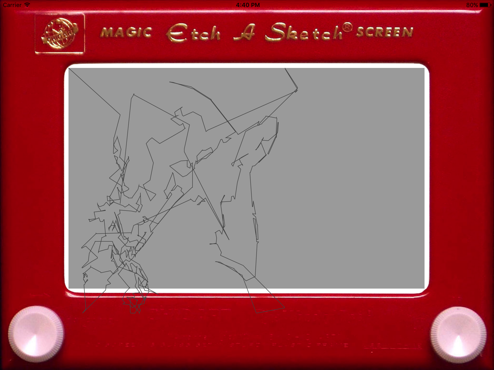

# Reverse Etch A Sketch

## Background

The end goal of this project is to take a photo and draw it on an [Etch A Sketch](https://en.wikipedia.org/wiki/Etch_A_Sketch) board before your very eyes. You walk up to this thing, hit a button, and wait for it to draw you. I set a goal of 5 minutes for the maximum time from when the button is pressed to when the drawing is complete. For the unfamiliar, the Etch A Sketch is a classic drawing toy for children dating back to the 1950s. I manipulate the knobs of the Etch A Sketch using two stepper motors, one for each knob. A Raspberry Pi 3 controls the motors, and also runs the image processing code locally.

I chose to write the library containing core of the algorithm, `libEtchASketch`, in C++ for performance, portability, compatibility, and energy efficiency. During development, I built two clients using the library: a C++ wrapper running on the Pi called `etch`, and an Objective-C iOS app named `iEAS`. `etch` takes in an image file, runs it through the library, and uses the list of points spit out to control the stepper motors. iEAS also takes an image file, but instead of driving physical motors, it animates drawing on a virtual Etch A Sketch. Running iEAS is much more convenient than the Pi for prototyping algorithms. It doesn’t require lugging around hardware, it runs on a laptop computer which is faster than the Pi, and the simulated drawing speed is much faster than drawing on a physical Etch A Sketch.

It may be helpful to quickly recap some terminology used. An Etch A Sketch is referred to as a *board*. The *nib* is the part of the Etch A Sketch controlled by the knobs that actually draws. The motors controlling the nib do not have any spatial awareness and they will gladly attempt to drive the nib off the side of the screen through a *wall*.

## Implementation

I faced many choices during the development of this project. They are explored here in the order in which they execute during a computation run. For the purposes of these examples, Lena (fig. 1) is the test image used.

_Figure 1: Lena, our original image._

The first step in the computation sequence is to convert the input image to grayscale for edge detection. I simply take the average of the red, green, and blue components of each pixel to get its gray value (fig. 2).

_Figure 2: Grayscale image._

The grayscale image is then fed through a Sobel edge detector, chosen for its simplicity of implementation. I use the standard window size of 3x3. The initial results produced were adequate but not great. Unfortunately, the product suffered from a high degree of noise, as can be seen in fig. 3. This noise was reduced significantly by adding a small Gaussian blur (of radius 4) before performing edge detection (fig. 4), though much detail is lost in the process.

_Figure 3: Sobel without a Gaussian blur._

_Figure 4: Sobel with a Gaussian blur._

Once the image has been fed through edge detection, an unordered set of all points lying on an edge is extracted. This is done by finding the X-Y coordinates of each white pixel in the edge detected image. The Etch A Sketch always starts from the top left corner of the device, so the starting point (0,0) is added if necessary.

The unordered set of edge points is put in the order in which they should be drawn. We have a list of points we must reach, and we must visit each point exactly once. Since an Etch A Sketch cannot lift the nib, we must draw the edges with one single continuous line. We must visit these points in the minimum possible distance, both to minimize visual disruption to the image and to reduce the time required to draw it. This is an analog of the [traveling salesman problem](https://en.wikipedia.org/wiki/Travelling_salesman_problem), which means this problem is [NP-hard](https://en.wikipedia.org/wiki/NP-hardness). But we want to finish our computations and draw the user in under 5 minutes. How do we solve this problem? The answer is simple: we don’t. Instead, we solve an easier problem. I have come up with a few simpler versions of the problem, each of which is solved using a different Salesman, which is what I call my various non-traveling salesman problem solvers. After the salesman (any salesman) has done its work, we have a vector of points that represent one continuous line that can be used to draw the image.

The Nearest Neighbor Salesman (NNS) is the first salesman I implemented. Accordingly, it is a rather simple salesman. The NNS creates a [K-d tree](https://en.wikipedia.org/wiki/K-d_tree) containing all the points to be drawn. Starting at our starting point (0,0), it asks the K-d tree for the nearest neighbor to its current position. It updates the current position to the neighbor’s position, adds the neighbor to the list of ordered points, and removes it from the K-d tree so we don’t visit it again. This repeats until the K-d tree is empty, which means we have visited all of the points to be drawn. This algorithm looks good at first since it keeps all lines contiguous, including thicker lines. Unfortunately, towards the end of the drawing, the NNS tends to introduce long lines that cross the entire image as it reaches over to the other side for those last few points that it hasn’t gotten around to yet (figs. 5, 6).

_Figure 5: Nearest Neighbor Salesman. No Gaussian blur for edge detection. A dark blue dot represents each edge point. The light blue lines trace the path of the nib._

_Figure 6: Nearest Neighbor Salesman with just the lines shown._

The Bob and Weave Salesman (BWS) is the best-looking salesman by far. Previous salesmen have tried to minimize the distance they must cross while traveling between edge points, because lines in an area that should be left blank reduce the perceived quality of the image. But what if giant lines all the way across the board didn’t reduce the perceived quality of the image? What if instead of minimizing the number of lines crossing over the entire image, we instead put lines everywhere in the image? If the lines are spaced at regular intervals, people observing the drawing will be able to ignore them, like looking through a chain link fence. Picture it like this: the BWS starts out with horizontal lines spanning the entire width of the board, repeated vertically every 4 pixels. Now replace each horizontal line with a sine wave. Hold that thought for a second. BWS does not use the edge detected image. Instead, it looks at the image itself to extract the brightness of the image every so often along the horizontal lines. The Etch A Sketch board is a light gray color, and lines appear dark gray. So what the BWS does is wherever the image is brighter, it reduces the amplitude of the sine wave, allowing more of the light background to shine through. And wherever the image is darker, it increases the amplitude of the sine wave, shading more of the background. An early rendering of the BWS can be seen in figure 7. Unfortunately, since the BWS requires filling basically the entire board with lines of small details, it requires a high precision and it takes an extremely long time to draw on a physical Etch A Sketch. In fact, I have never seen it complete a drawing on hardware. I estimate it would take about an hour to complete a drawing, well above my 5 minute target. This is a shame, since the BWS is extremely performant and trivially parallelizable, and would even lend itself well to running on a GPU.

_Figure 7: The Bob and Weave Salesman with a close-up of the detail produced._

In an effort to reduce the time required to draw the image, I perform a pass of the [Douglas-Peucker line simplification algorithm](https://en.wikipedia.org/wiki/Ramer–Douglas–Peucker_algorithm) to reduce the number of points that must be drawn. The basic idea is to remove points whenever their removal doesn’t hurt the fidelity of the output image by more than a certain threshold value. I found that the result looks best at ε = 20 (figs. 8, 9). This is a “close enough is good enough” approach to drawing the line, and it greatly reduces the number of points drawn. In fact, it reduces the number of points needed by almost 90%! This is a significant improvement.

_Figure 8: Before line simplification. 5087 points._

_Figure 9: After line simplification. 623 points._

Finally, once we have our edge points in the correct order for drawing, we can scale them to the correct size for our output device. For example, our friend Lena is a petite woman at just 512x512 pixels. But the drawing area of the iOS simulator is 1476x916 pixels. The physical Etch A Sketch uses stepper motors to draw; if we count the smallest possible step size of a motor as 1 pixel, the size of the Etch A Sketch screen is 13000x9500 “pixels” (including padding around the edges to make sure we don’t try to drive the nib through a wall). So we scale up the points from the image’s resolution to the output device’s resolution before we return the list of ordered points. The driver for the drawing device (either the simulator or the board) takes care of interpolation if there are gaps between consecutive points.

## Quality of Results

The final product does not look great. When you see the original and the drawing side-by-side, it’s definitely recognizable. But you wouldn’t recognize somebody you see drawn on the board without some kind of a hint. It works fine for things like stick figures though. Performance is adequate using the NNS; it draws our friend Lena in about 5 minutes (see video 1).

The hardware aspect of the board is outside the scope of this paper. You can find a high-level overview of the hardware setup [here](https://www.icloud.com/keynote/0Zn7Z1xenVRJlimIRGz1t2ifg#rEAS_296_presentation).

_Video 1: The board drawing Lena._

_Video 2: The board drawing a stick figure._

## To Do

There’s plenty of work that can be done. This is a selection of some of the larger concepts:
- Switch to a full Canny edge detector.
- Implement Bresenham’s line algorithm in the motor drivers to symmetrically interpolate lines.
- Finish implementing the Smallish Spanning Tree Salesman.
- Downscale a high resolution input image to the size of the output device to accelerate computation for large input images.
- Refactor the simulator to better emulate the board’s interpolation and performance characteristics.
- Improve thread safety.
- Better track the current stage of computation in the algorithmic library.
- Improve parallelism all around.
- Run the edge detector on the GPU.

This project would not have been possible if it weren’t for the help and support of a good many people. Many thanks to Jeff Erickson for his guidance and suggestions, and to Carl Evans for his financial support. Thanks to Bill Chapman, Bliss Chapman, Bri Chapman, Henry Chopp, Anil Jason, both Joes, Donovan King, Nacho, Shivam, David Silin, Brian Zhou, and anybody else I may have forgotten.

---------
# In Other News…

## Hardware
Drawable area on an Etch-a-Sketch: 154 mm wide by 108 mm tall.

## License
This project is currently licensed under GPLv3. See [LICENSE](LICENSE) for the full license text.

I may change this license at some point in the future, so if you're bothered by GPLv3, check back often! Alternatively, drop me a line and we may be able to set something up.
