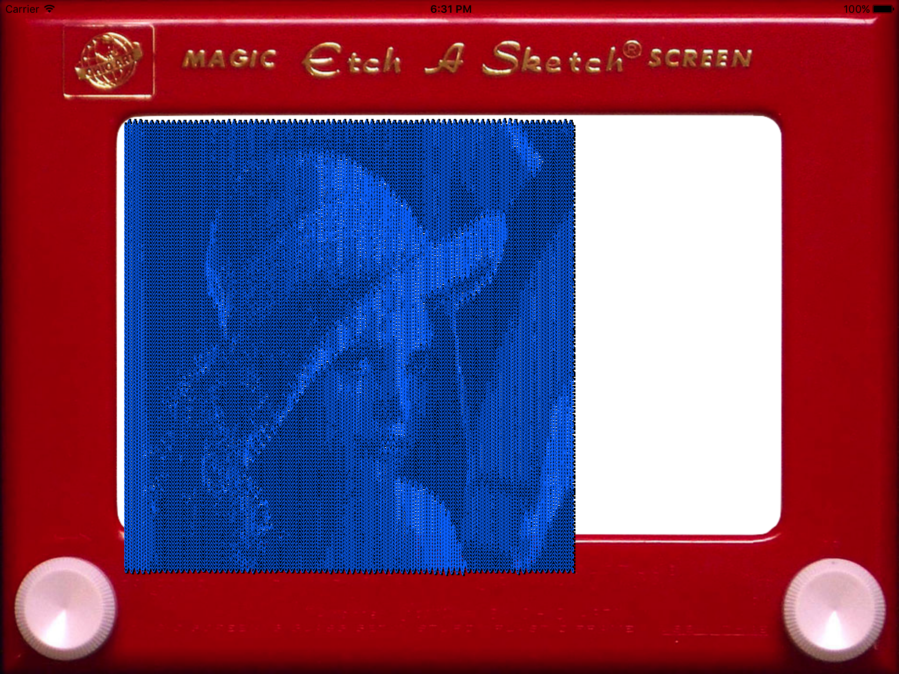
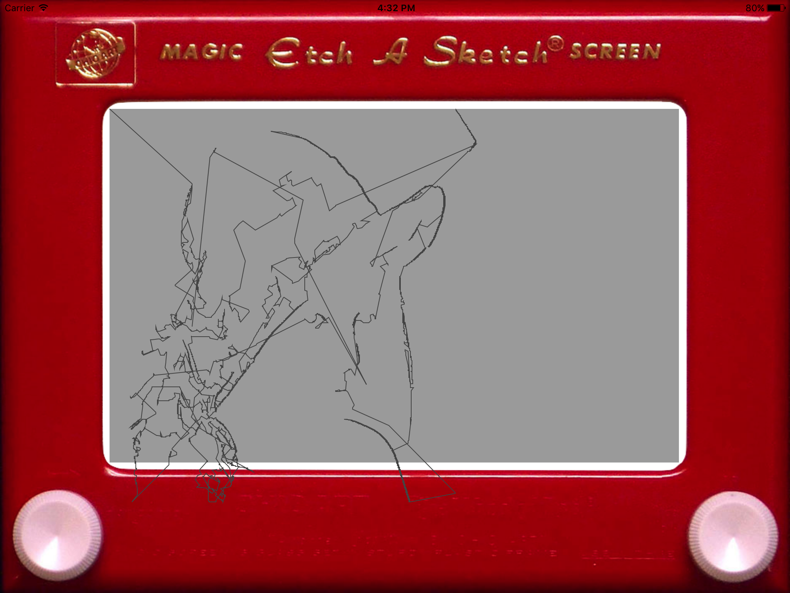

# Lena
CS296-41 End-of-semester presentation slides giving an overview of the project can be found [here](https://www.icloud.com/keynote/0Zn7Z1xenVRJlimIRGz1t2ifg#rEAS_296_presentation).

TODO: Write a project description.

## Current Status
### Original

### Current Product

## Features
### Line Simplification
The [Douglas-Peucker algorithm](https://en.m.wikipedia.org/wiki/Ramer–Douglas–Peucker_algorithm) is used to simplify lines. This has the effect of reducing visual noise and reducing the drawing time of the image.

Without line simplification: 
With line simplification: 

## Installation

TODO: Describe the installation process

## Usage
TODO: Write usage instructions

## Hardware
Drawable area on an Etch-a-Sketch: 154 mm wide by 108 mm tall.

## History
TODO: Write history

## Credits
TODO: Write credits

## License
This project is currently licensed under GPLv3. See [LICENSE](LICENSE) for the full license text.

I may change this license at some point in the future, so if you're bothered by GPLv3, check back often! Alternatively, drop me a line and we may be able to set something up.
